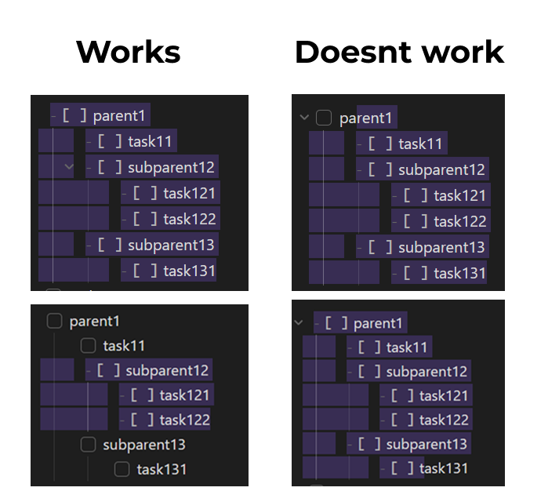

# Summary

This project is designed to conveniently work with tasks in custom Templater scripts.

# Manual build guide
`npm install` - instalation, before any build<br>
`npm run build:local` - building to dist folder <br>
`npm run build:vault` - building by .env variables

# ENV Variables

## System

| Variable         | Required | Description                    | Default value |
| ---------------- | -------- | ------------------------------ | ------------- |
| VAULT_PATH       | Yes      | The path to the Obsidian Vault | -             |
| SCRIPTS_FOLDER   | No       | Template scripts folder        | Scripts       |
| TEMPLATES_FOLDER | No       | Templater templates folder     | Templates     |
| FILENAME         | No       | Script name with extension     | TTP.js        |

## Templates customization

| Variable                             | Description                                      | Default value          |
| ------------------------------------ | ------------------------------------------------ | ---------------------- |
| LOCALE                               | Localization<br><br>EN - English<br>RU - Russian | EN                     |
| ADD_TAGS_TEMPLATE_NAME               | Add tags template name                           | addTags.md             |
| REMOVE_TAGS_TEMPLATE_NAME            | Remove tags template name                        | removeTags.md          |
| TAGS_LIKE_PARENT_TEMPLATE_NAME       | Tags like parent template name                   | tagsLikeParent.md      |
| DEVIDE_BY_COMPLETED_TEMPLATE_NAME    | Devide by completed template name                | devideByCompleted.md   |
| DEVIDE_BY_HAS_CATEGORY_TEMPLATE_NAME | Devide by has task category template name        | devideByHasCategory.md |
| COUNTER_TEMPLATE_NAME                | Counter template name                            | counter.md             |
| CATEGORY                             | Category tags starts with                        | category               |

# Templates

To make most of the templates work, you need to select the entire line, from beginning to end<br>
To execute the template, you don't need to separate the entire task list from the root task.



You can specify a category to work with some templates. By category, I mean tags combined with one beginning, for example, for the tags #category/health and #category/work, the category will be "category"

## Add tags
Enter the tags you want to add to selected tasks in the promt separated by a space. You can specify them with or without a hashtag.<br>
<br>
<b>Example</b><br>
Origin selection:
```
- [ ] task 1
    - [ ] task 2
    - [ ] task 3
```
promt: `tag1 #tag2`<br>
Result selection:
```
- [ ] task 1 #tag1 #tag2
    - [ ] task 2 #tag1 #tag2
    - [ ] task 3 #tag1 #tag2
```

## Remove tags
Enter the tags you want to remove from selected tasks in the promt separated by a space. You can specify them with or without a hashtag.<br>
<br>
<b>Example</b><br>
Origin selection:
```
- [ ] task 1 #tag1 #tag2
    - [ ] task 2 #tag1 #tag2
    - [ ] task 3 #tag1 #tag2
```
promt: `tag1 #tag2`<br>
Result selection:
```
- [ ] task 1
    - [ ] task 2
    - [ ] task 3
```

## Tags like parent 
Uses category<br>
Assigns all tags in the selection a category like the parent's<br>
<br>
<b>Example</b><br>
Origin selection:
```
- [ ] task 1 #category/life
    - [ ] task 2
    - [ ] task 3
```
Result selection:
```
- [ ] task 1 #category/life
    - [ ] task 2 #category/life
    - [ ] task 3 #category/life
```

## Devide by category
Divides tasks into completed and incomplete ones.  Unfinished at the top<br>
<br>
<b>Example</b><br>
Origin selection:
```
- [x] task 1
- [-] task 2
- [ ] task 3
```
Result selection:
```
- [ ] task 3
- [x] task 1
- [-] task 2
```

## Devide by has tags
Uses category<br>
Divides tasks into tasks that have a category and those that do not have Tasks without a category at the top<br>
<br>
<b>Example</b><br>
Origin selection:
```
- [ ] task 1 #category/life
    - [ ] task 2
    - [ ] task 3
```
Result selection:
```
- [ ] task 1 #category/life
    - [ ] task 2 #category/life
    - [ ] task 3 #category/life
```

## Counter
Creates task counters. You need to select 1 task with a number. If the task is completed, it adds N new tasks starting from X+1, if not, it adds tasks up to N. X is the number in the highlighted task<br>
If task description is empty starts with 1 and goes to N<br>
<br>
<b>Example</b><br>
Origin selection:
```
- [ ] 1
```
promt: `3`<br>
Result selection:
```
- [ ] 1
- [ ] 2
- [ ] 3
```
Origin selection:
```
- [x] 1
```
promt: `3`<br>
Result selection:
```
- [x] 1
- [ ] 2
- [ ] 3
- [ ] 4
```